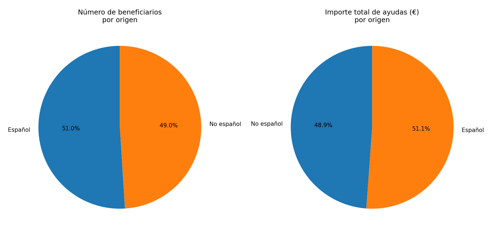

# Ayudas al Alquiler CAM 2024 — Análisis de datos

Análisis de la lista definitiva de beneficiarios de la convocatoria de ayudas al alquiler para jóvenes de la Comunidad de Madrid (2024), publicada en:

> **Fuente:** [Preguntas frecuentes — Orden de ayudas al alquiler 2024 (CAM)](https://sede.comunidad.madrid/medias/20251216preguntasfrecuentesorden2024pdf/download)

El PDF original contiene la resolución con los admitidos definitivos (`jovenes_admitido_definitivo_publicar.pdf`).

---

## Metodología

1. **`parse_pdf.py`** — extrae las filas del PDF con `pdfplumber` mediante expresión regular, limpia los importes y clasifica cada beneficiario como de nombre probable español o no español comparando sus nombres de pila contra un dataset de nombres españoles (`spanish_names.csv`). El resultado se exporta a `ayudas_alquiler_cam_2024.csv`.

2. **`graficas.py`** — lee el CSV y genera dos gráficos de tarta comparando el número de beneficiarios y el importe total percibido, segmentados por origen del nombre. Se guarda en `graficas_ayudas.png`.

> **Nota sobre la clasificación:** un beneficiario se considera de nombre probable español cuando **todos** sus nombres de pila aparecen en el dataset de nombres españoles. Es una heurística conservadora; los falsos negativos (nombres españoles no reconocidos) son posibles.

---

## Resultados

| Métrica | Total | Nombres españoles | Nombres no españoles |
|---|---|---|---|
| Beneficiarios | **4.035** | 2.058 (51,0 %) | 1.977 (49,0 %) |
| Importe total | **10.016.896,38 €** | 5.123.215,01 € (51,1 %) | 4.893.681,37 € (48,9 %) |
| Ayuda media | **2.482,50 €** | 2.489,41 € | 2.475,31 € |
| Ayuda máxima | **5.400,00 €** | — | — |
| Ayuda mínima | **10,08 €** | — | — |

**Conclusión principal:** la distribución de beneficiarios y del importe total está prácticamente igualada entre personas con nombres de apariencia española y personas con nombres de apariencia no española (≈51 % / 49 %). La ayuda media es muy similar en ambos grupos (~2.480 €), lo que indica que el criterio de concesión es independiente del origen del nombre.



---

## Instalación

El proyecto usa [uv](https://github.com/astral-sh/uv) para gestionar el entorno.

```bash
# Instalar uv (si no lo tienes)
curl -LsSf https://astral.sh/uv/install.sh | sh

# Instalar dependencias
uv sync
```

---

## Uso

### 1. Parsear el PDF y generar el CSV

```bash
uv run python parse_pdf.py
```

Genera `ayudas_alquiler_cam_2024.csv` con las columnas:
`orden`, `expediente`, `nombre`, `nif_nie`, `baremo`, `ayuda`, `ayuda_num`, `español`

### 2. Generar las gráficas

```bash
uv run python graficas.py
```

Genera `graficas_ayudas.png` con los dos gráficos de tarta.

---

## Dependencias

| Paquete | Versión mínima | Uso |
|---|---|---|
| `pdfplumber` | 0.11.9 | Extracción de texto del PDF |
| `pandas` | 3.0.2 | Procesamiento de datos |
| `matplotlib` | 3.10.9 | Visualización |
